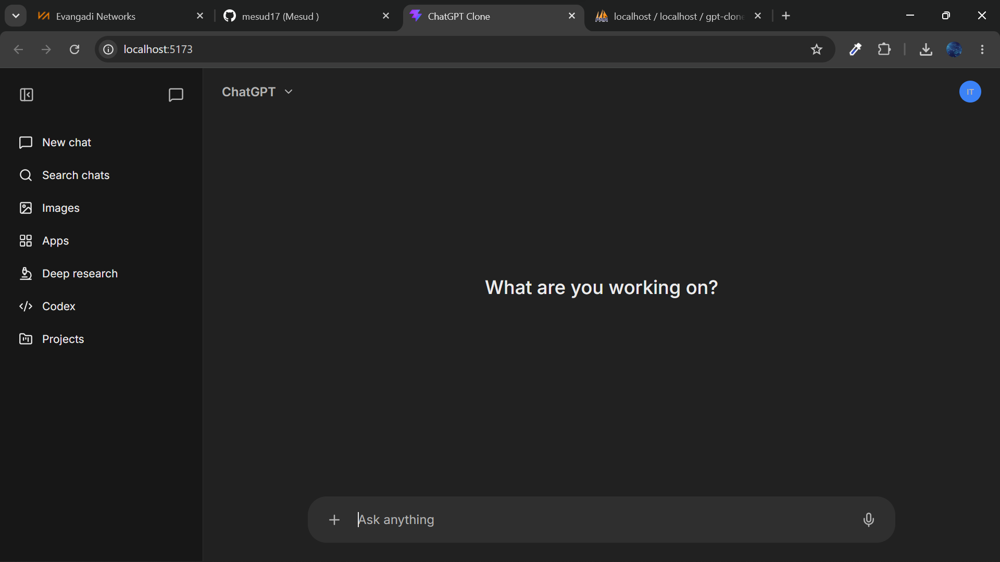
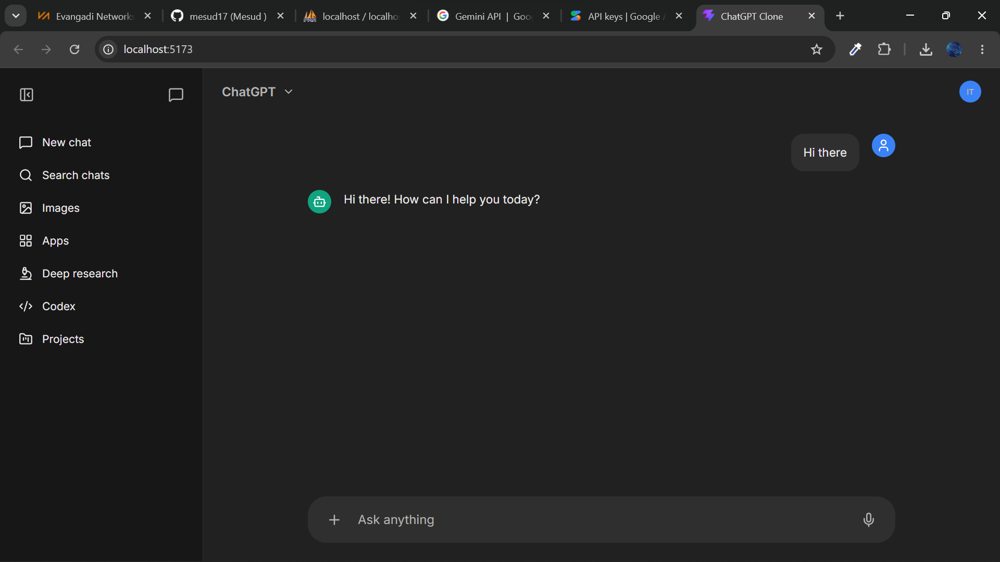

# GPT Clone

A full-stack AI chat application powered by Google Gemini, built with React and Node.js. Features a clean ChatGPT-inspired UI, real-time AI responses, and persistent conversation history stored in a MySQL database.

---


## Features

- AI-powered chat using Google Gemini API
- Persistent conversation history stored in MySQL
- Conversation context — the AI remembers recent messages
- Optimistic UI updates — user message appears instantly before AI responds
- Token usage tracking per response
- Error handling with user-friendly fallback messages
- ChatGPT-inspired responsive UI

---

## Tech Stack

### Frontend
| Technology | Purpose |
|-----------|---------|
| React 19 | UI framework |
| Axios | HTTP requests to backend |
| Vite | Build tool |
| CSS Modules | Component scoped styling |

### Backend
| Technology | Purpose |
|-----------|---------|
| Node.js + Express 5 | REST API server |
| MySQL2 | Database driver |
| Google Gemini API | AI response generation |
| dotenv | Environment variable management |
| CORS | Cross-origin request handling |

### Database
| Technology | Purpose |
|-----------|---------|
| MySQL | Persistent conversation storage |

---

## Project Structure

```
GPT-clone/
├── Backend/
│   ├── db/
│   │   ├── db.config.js        # MySQL connection pool
│   │   └── schema.sql          # Database schema
│   ├── src/
│   │   ├── api/
│   │   │   ├── chat/
│   │   │   │   ├── chat.route.js        # Chat routes
│   │   │   │   ├── controller/
│   │   │   │   │   └── chat.controller.js
│   │   │   │   └── service/
│   │   │   │       └── chat.service.js  # Core business logic
│   │   │   └── main.route.js            # Root router
│   │   └── middleware/
│   │       └── error-handler.js         # Global error handler
│   ├── index.js                # App entry point
│   └── package.json
└── Frontend/
    ├── src/
    │   ├── components/
    │   │   ├── ChatHeader/      # Top header bar
    │   │   ├── ChatInput/       # Message input box
    │   │   ├── ChatMessage/     # Individual message bubble
    │   │   ├── MessageList/     # Scrollable message list
    │   │   └── Sidebar/         # Left sidebar
    │   ├── App.jsx              # Root component and state management
    │   └── main.jsx
    └── package.json
```

---

## Database Schema

```sql
CREATE TABLE IF NOT EXISTS conversations (
    id         BIGINT UNSIGNED AUTO_INCREMENT PRIMARY KEY,
    role       ENUM('user', 'assistant') NOT NULL,
    content    TEXT NOT NULL,
    token_count INT UNSIGNED NOT NULL DEFAULT 0,
    created_at TIMESTAMP NOT NULL DEFAULT CURRENT_TIMESTAMP
);
```

---

## Getting Started

### Prerequisites
- Node.js >= 18
- MySQL database
- Google Gemini API key — get one at [Google AI Studio](https://aistudio.google.com)

### 1. Clone the repository
```bash
git clone https://github.com/your-username/gpt-clone.git
cd gpt-clone
```

### 2. Set up the database
```bash
mysql -u root -p
```
```sql
CREATE DATABASE gpt_clone;
USE gpt_clone;
SOURCE Backend/db/schema.sql;
```

### 3. Configure backend environment variables

Create a `.env` file inside the `Backend/` directory:
```env
GEMINI_API_KEY=your_gemini_api_key
GEMINI_MODEL=gemini-2.5-flash
DB_HOST=localhost
DB_USER=root
DB_PASSWORD=your_password
DB_NAME=gpt_clone
```

### 4. Install and run the backend
```bash
cd Backend
npm install
node index.js
```

### 5. Install and run the frontend
```bash
cd Frontend
npm install
npm run dev
```

The app will be available at `http://localhost:5173`

---

## API Endpoints

| Method | Endpoint | Description |
|--------|----------|-------------|
| GET | `/api/chat/conversations` | Fetch recent conversations |
| POST | `/api/chat/conversations` | Send a message and get AI response |

### POST `/api/chat/conversations`

**Request:**
```json
{ "question": "Hello, how are you?" }
```

**Response:**
```json
{
  "question": {
    "userConversation": {
      "id": 1,
      "role": "user",
      "content": "Hello, how are you?",
      "token_count": 0,
      "created_at": "2026-06-01T08:22:55.000Z"
    },
    "assistantConversation": {
      "id": 2,
      "role": "assistant",
      "content": "Hi there! How can I help you today?",
      "token_count": 353,
      "created_at": "2026-06-01T08:22:58.000Z"
    }
  }
}
```

### Chat Interface



---

## License

This project is for educational and portfolio purposes only.
ChatGPT and GPT are trademarks of OpenAI.